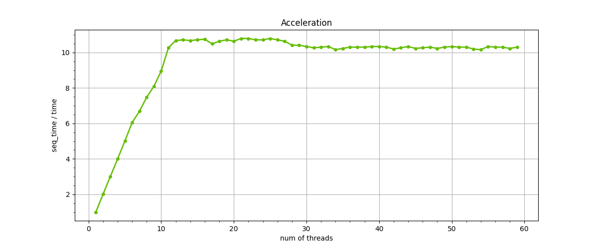
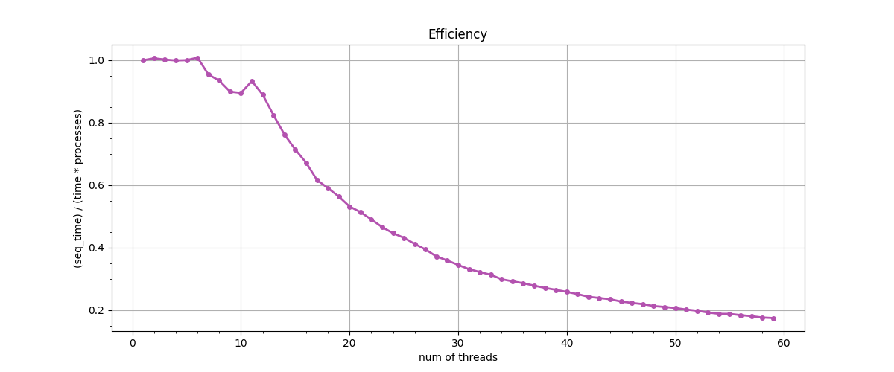

# Calculate integral concurrently.
## This program computes integral `sin(1/x)` from 0.001 to 1.0.
## How to run:
### Start the code below:
```shell
cmake . -B build/
cd build
make
./Integral <num_threads, for example, 10> <error, for example, 0.000001>
```
## In order to get compute graphs:
```shell
python3 acceleration.py 
```
### The code above creates `graphs/Acceleration.png` and `graphs/Efficiency.png`:

