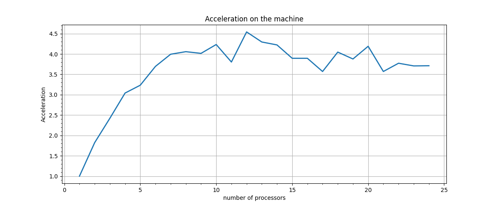

# Parallel Merge sort
## The graph of acceleration below. Acceleration is the ration of sequential execution time to parallel execution time.



## How to run
### From the path start
```shell
python3 graph.py
```