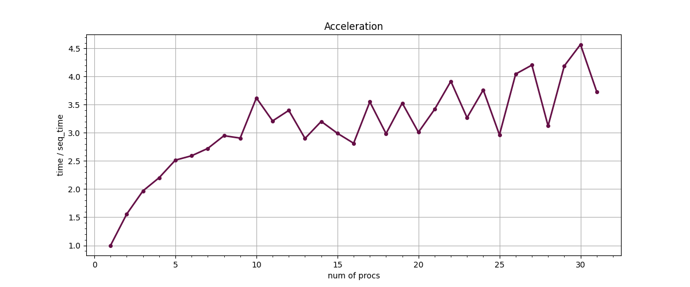

# Parallel solving of transport equation via rectangle scheme.
## Equation
### Here the equation below is solved via rectangle scheme.
Read [here](https://en.wikipedia.org/wiki/Finite_difference_method#Explicit_method) about Finite difference methods.


## On grid 2500 * 2500 The Solution looks like


## There are implemented 2 programs that computed it.
## `sequential.c` is sequential solution and `parallel.c` does it in parallel.
## Graphs below shows parameters of parallel computation:

### Complexity of algorithm on 5 processes:


### Acceleration of paralleling:


### Efficiency of paralleling:


## How to run:
### From the path start the code below
```asm
$ cmake . -B build/
$ cd build/ && make
$ mpirun -np <num_of_procs> --oversubscribe  ./Parallel <x_len> <t_len> <file_where_to_save>
```
### The last argument is optional, default value is "solution.csv".

### In order to start any python scripts start
```
$ python3 <script>
```
### For instance the code below paints Acceleration and Efficiency graphs.
```
$ python3 acceleration.py
```